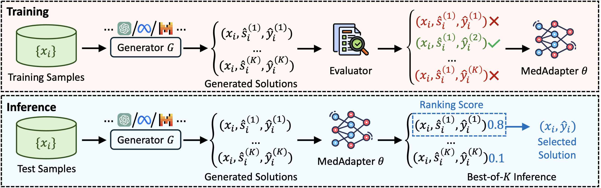

# MedAdapter
This is the code for our paper ["MedAdapter: Efficient Test-Time Adaptation of Large Language Models Towards Medical Reasoning"](https://arxiv.org/abs/2405.03000) in EMNLP 2024.

## Framework


## Data
You need to first download the raw data from the following sources: [MedMCQA](https://huggingface.co/datasets/openlifescienceai/medmcqa), [MedQA](https://huggingface.co/datasets/bigbio/med_qa), [MMLU-Med](https://huggingface.co/datasets/cais/mmlu), [PubMedQA](https://huggingface.co/datasets/qiaojin/PubMedQA), [BioASQ](http://bioasq.org/), [MedNLI](https://huggingface.co/datasets/bigbio/mednli), [MediQA-RQE](https://huggingface.co/datasets/bigbio/mediqa_rqe), [PubHealth](https://huggingface.co/datasets/bigbio/pubhealth), [MediQA](https://huggingface.co/datasets/bigbio/mediqa_qa?row=0), and [CORD19](https://huggingface.co/datasets/allenai/cord19). Please download the data and save in the ``./data/<DATASET_NAME>/`` directory.

## Experiments

### Candidate Solution Generation
Before training the model, we need to first leverage the LLM to generate candidate solution for the following reward model training. We need to generate the candidates on both training and test sets. For OpenAI commercial models (e.g., gpt-3.5-turbo, gpt-4), we need to call ``main-openai.py`` to initiate the generation process:
```python
python main-openai.py --debug generation --config configs/bioasq/bioasq-gen-test.yaml
python main-openai.py --debug generation --config configs/bioasq/bioasq-gen-train.yaml
```

For the open-sourced LLMs, we need to leverage the [vLLM](https://docs.vllm.ai/en/latest/getting_started/quickstart.html) as the inference model engine and need to run ``main.py`` to initiate the generation process:
```python
CUDA_VISIBLE_DEVICES=1,2 accelerate launch --mixed_precision fp16 --main_process_port 29650 main.py --debug generation --config configs/bioasq/bioasq-gen-test.yaml
CUDA_VISIBLE_DEVICES=1,2 accelerate launch --mixed_precision fp16 --main_process_port 29650 main.py --debug generation --config configs/bioasq/bioasq-gen-train.yaml
```

The ``--config`` indicate the generation configuration during inference, containing important hyperparameters. The configuration files should be stored in the directory ``./configs/<Dataset_Name>/<Model_Name>/``.

### Outcome-Supervised Adapter Training
To train the model, we need to run the ``main.py`` entry program:
```python
CUDA_VISIBLE_DEVICES=0 accelerate launch --mixed_precision fp16 --main_process_port 29666 main.py --debug reward --config configs/bioasq/bioasq-reward.yaml
```
The configuration file of training the adapter should also be saved under ``./configs/<Dataset_Name>/<Model_Name>/`` directory.

### Best-of-K Inference
Same as the previous two stages, we need to run the entry program ``main.py`` again to inference on the previously generated candidates on test set:
```python
CUDA_VISIBLE_DEVICES=0 accelerate launch --mixed_precision fp16 --main_process_port 29666 main.py --debug reward_guide --config configs/bioasq/bioasq-guide.yaml
```
The configuration file of training the adapter should also be saved under ``./configs/<Dataset_Name>/<Model_Name>/`` directory.

### Running Scripts
We also offer several examples of running commands in the directory ``./scripts``.

## Citation
If you find this repository valuable for your research, we kindly request that you acknowledge our paper by citing the follwing paper. We appreciate your consideration.

```
@inproceedings{shi-etal-2024-medadapter,
    title = "{M}ed{A}dapter: Efficient Test-Time Adaptation of Large Language Models Towards Medical Reasoning",
    author = "Shi, Wenqi  and
      Xu, Ran  and
      Zhuang, Yuchen  and
      Yu, Yue  and
      Sun, Haotian  and
      Wu, Hang  and
      Yang, Carl  and
      Wang, May Dongmei",
    editor = "Al-Onaizan, Yaser  and
      Bansal, Mohit  and
      Chen, Yun-Nung",
    booktitle = "Proceedings of the 2024 Conference on Empirical Methods in Natural Language Processing",
    month = nov,
    year = "2024",
    address = "Miami, Florida, USA",
    publisher = "Association for Computational Linguistics",
    url = "https://aclanthology.org/2024.emnlp-main.1244",
    doi = "10.18653/v1/2024.emnlp-main.1244",
    pages = "22294--22314",
    abstract = "Despite their improved capabilities in generation and reasoning, adapting large language models (LLMs) to the biomedical domain remains challenging due to their immense size and privacy concerns. In this study, we propose MedAdapter, a unified post-hoc adapter for test-time adaptation of LLMs towards biomedical applications. Instead of fine-tuning the entire LLM, MedAdapter effectively adapts the original model by fine-tuning only a small BERT-sized adapter to rank candidate solutions generated by LLMs. Experiments on four biomedical tasks across eight datasets demonstrate that MedAdapter effectively adapts both white-box and black-box LLMs in biomedical reasoning, achieving average performance improvements of 18.24{\%} and 10.96{\%}, respectively, without requiring extensive computational resources or sharing data with third parties. MedAdapter also yields enhanced performance when combined with train-time adaptation, highlighting a flexible and complementary solution to existing adaptation methods. Faced with the challenges of balancing model performance, computational resources, and data privacy, MedAdapter provides an efficient, privacy-preserving, cost-effective, and transparent solution for adapting LLMs to the biomedical domain.",
}
```
